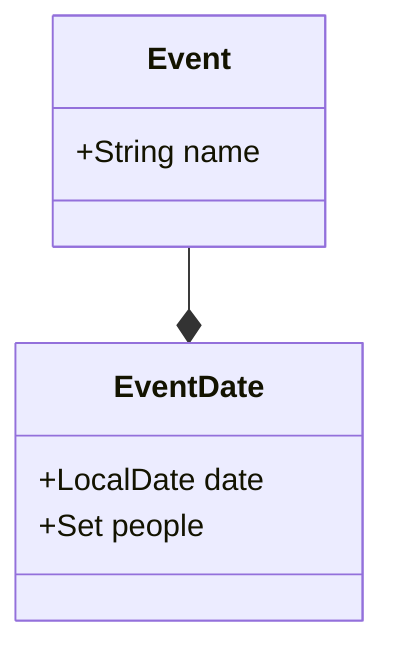
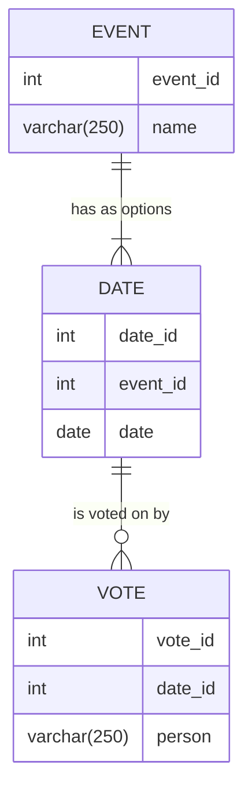

[](https://github.com/heitzuli/EventShuffle/actions/workflows/gradle.yml)

## Event Shuffle

Ever needed a simple yet fast way to decide upon a date to get revenge on behalf of Captain Jack? Problems scheduling your keel hauling?<br /><br />
The main feature of the project is managing events and user votes. The EventController class provides endpoints to create events, vote on events, and retrieve event results. The EventService class handles the business logic, such as creating events and calculating voting results.

The createEvent method in EventService takes a CreateRequest object, validates the input, and stores the event.
The vote method takes an event ID and a VoteRequest, updates the vote count for the specified date, and returns the updated event.
The getResult method calculates the most suitable dates based on user votes and returns the results.


### How to run the application
1. Download Java 21 or higher
2. Clone this repository
3. Run gradle in the root directory<br/>

MacOS/Linux
```sh
./gradlew bootRun
```
<br />Windows
```Powershell
gradlew.bat bootRun
```

### How to use the application

The API's autogenerated [swagger documentation](https://swagger.io/specification/) can be found at http://localhost:8080/swagger-ui/index.html

`/http-tests/api-test.http` contains https tests that can be run with [IntelliJ IDEA http client](https://www.jetbrains.com/help/idea/http-client-in-product-code-editor.html).
I haven't tried this myself, but some Googling revealed that [httpYac](https://httpyac.github.io/) can run the same tests.


### Domain model



### Database
While Googling how to document databases I found this [mermaid](https://mermaid.js.org/syntax/entityRelationshipDiagram.html)

_"You're the one who insisted on bringing the bloody mermaid!"_

