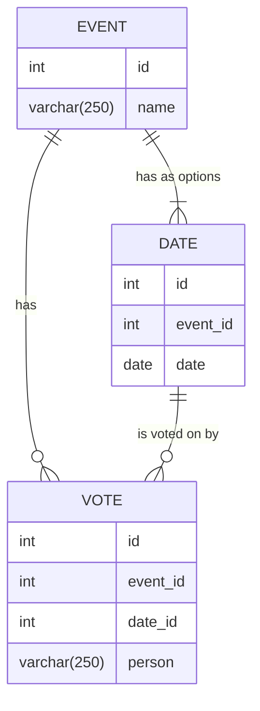

## Event Shuffle

### Database
While Googling how to document databases I found this [mermaid](https://mermaid.js.org/syntax/entityRelationshipDiagram.html)

_"You're the one who insisted on bringing the bloody mermaid!"_

